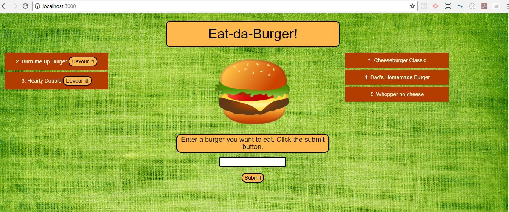
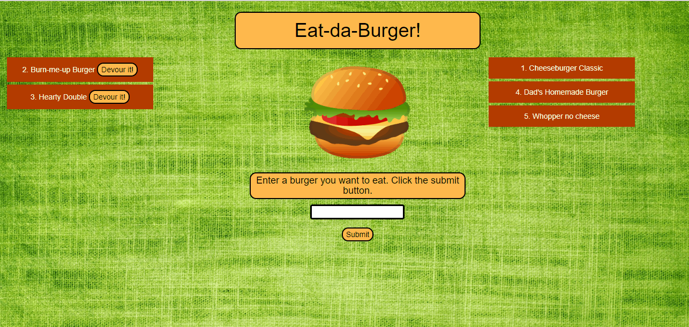
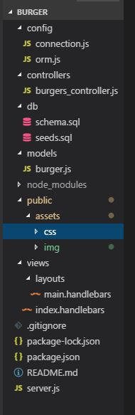

# Eat-Da-Burger!  
### Restaurant app using Node, Express, Handlebars

This full-stack application displays a list of burgers from a database. If the burger has been eaten (in other words, if the stored 'devoured' column is set to 'true' for that burger), it is displayed on the right side of the page.  Otherwise the burger is displayed on the left.  

### Changing Data

In the middle, there is a form area where the user can enter the name of another burger.  When submitted, 'devoured' is automatically set to false and the burger displays on the left side of the page.  This demonstrates the "create" or "insert" function of the CRUD model. When the client clicks on the 'Devour it!' button, the burger's 'devoured' column is set to 'true' in our database, and it appears on the right side of the page, demonstrating the "update" or "put" function.

### MVC Architecture

This application is a simple version of the MVC, or model-view-controller pattern.  The following is a screenshot of the structure of this application denoting the recommended architecture for the MVC model.

##### About this Application

This repository is for a full stack JavaScript application, employing various technologies, including NPM packages (Express, Body Parser, and Mysql), Handlebars templating, database handling, and styling with CSS. 
The application allows the client to interact with a server to submit and update data.  The data displays differently depending on its value in the 'devoured' column.  The application employs a simple client/server full-stack approach, with a front end (HTML-Handlebars, CSS), middleware (Express, Body-parser) and back end (ORM, models).  This project was created and is maintained by me, Marjika Howarth.
